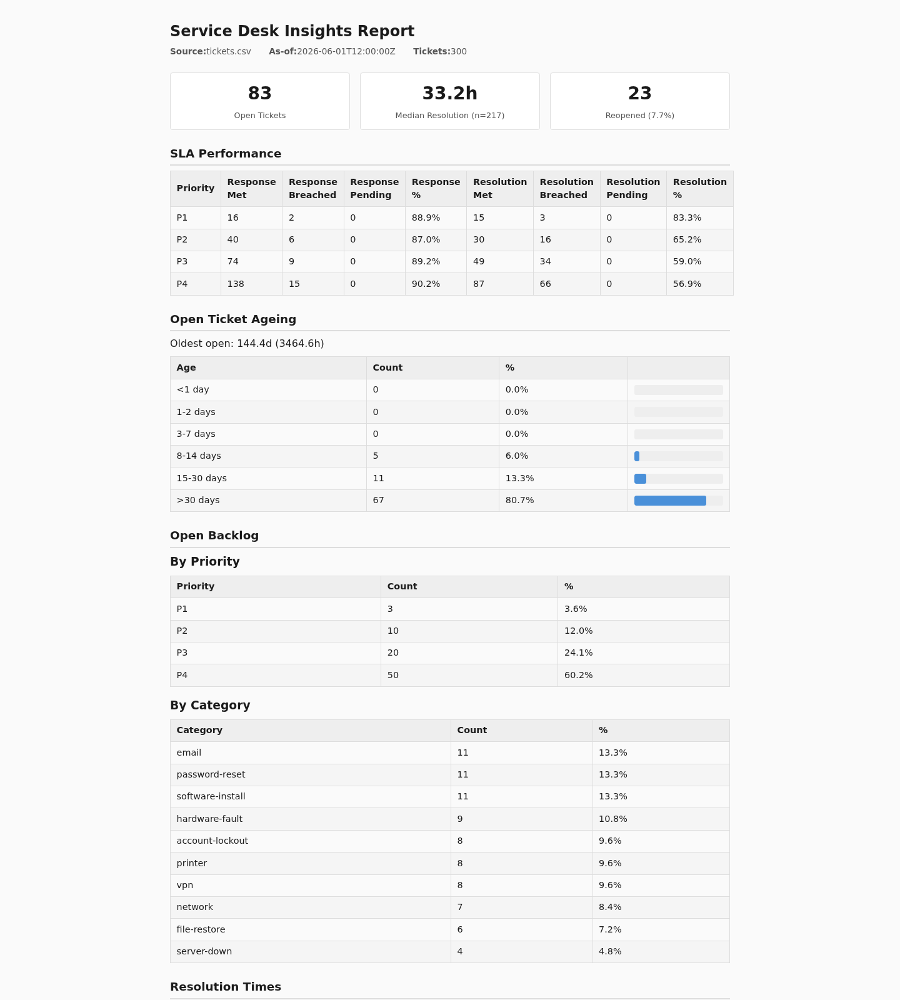
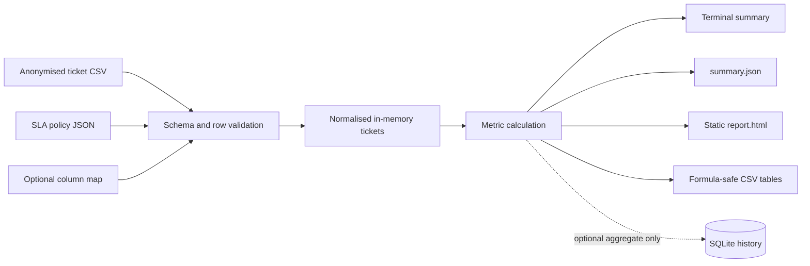

```text
 ___ ___ _____   _____ ___ ___   ___  ___ ___ _  __
/ __| __| _ \ \ / /_ _/ __| __| |   \| __/ __| |/ /
\__ \ _||   /\ V / | | (__| _|  | |) | _|\__ \ ' <
|___/___|_|_\ \_/ |___\___|___| |___/|___|___/_|\_\

 ___ _  _ ___ ___ ___ _  _ _____ ___
|_ _| \| / __|_ _/ __| || |_   _/ __|
 | || .` \__ \| | (_ | __ | | | \__ \
|___|_|\_|___/___\___|_||_| |_| |___/
```

# service-desk-insights

Local, reproducible reporting for anonymised service-desk ticket exports.

Small IT teams often have ticket data but no safe, repeatable way to answer basic
operational questions: which priorities miss service-level agreements (SLAs), how
old the backlog is, and whether demand is outpacing resolution. This command-line
tool validates one CSV export and produces the same metrics in terminal, JSON,
CSV and a self-contained HTML report. It runs locally and requires no account,
network service or customer data upload.

This is an alpha portfolio project. It supports operational review; it is not a
production service-management system or a substitute for source-system reporting.

## Install and run

Python 3.11 or later and [pipx](https://pipx.pypa.io/) are required.

```bash
git clone --branch v0.1.0 --depth 1 \
  https://github.com/ericjaytech/service-desk-insights.git
cd service-desk-insights
pipx install .

service-desk-insights generate-synthetic \
  --rows 300 --seed 42 \
  --start-date 2026-01-05 --weeks 20 \
  --output tickets.csv

service-desk-insights analyse tickets.csv \
  --sla-policy examples/sla-policy.json \
  --as-of 2026-06-01T12:00:00Z \
  --output-dir report

xdg-open report/report.html
```

Preview the calculation without creating a report or history database:

```bash
service-desk-insights analyse tickets.csv \
  --sla-policy examples/sla-policy.json \
  --as-of 2026-06-01T12:00:00Z \
  --output-dir report \
  --dry-run
```

## Example output

```text
Service Desk Insights Report
============================================================
  Source:         tickets.csv
  As-of:          2026-06-01T12:00:00Z
  Tickets:        300

SLA Performance
----------------------------------------
  P1:
    Response:   88.9%  (16/18 met, 0 pending)
    Resolution: 83.3%  (15/18 met, 0 pending)

Open Tickets: 83
  Oldest age:  144.4d (3464.6h)

Resolution Times (n=217)
  Median: 1.4d (33.2h)
  P90:    4.7d (113.7h)

Report written to: report
```

The example is generated from deterministic synthetic data:



## Architecture and data flow



The ingest and metric layers do not render or persist data. Renderers consume one
immutable metric result. Report files are built in a temporary directory and
renamed only after every required output succeeds.

## Input and synthetic fixtures

Canonical CSV input uses these columns:

| Column | Meaning |
| --- | --- |
| `ticket_id` | Unique ticket identifier |
| `created_at` | ISO-8601 creation timestamp |
| `first_response_at` | First response, or empty if pending |
| `resolved_at` | Resolution time, or empty if open |
| `status` | `open`, `resolved`, `closed`, `pending` or `on-hold` |
| `priority` | `P1`, `P2`, `P3` or `P4` |
| `category` | Free-text issue category |
| `reopen_count` | Non-negative reopen count |

Use `--column-map examples/column-map.json` for different headings. The test suite
contains synthetic canonical, mapped and hostile-label fixtures under
`tests/fixtures/`. `generate-synthetic` creates larger deterministic examples;
the same arguments produce the same rows.

## Outputs

Each successful analysis creates:

| Path | Purpose |
| --- | --- |
| `summary.json` | Versioned machine-readable metrics |
| `report.html` | Self-contained static report with no external assets |
| `tables/*.csv` | SLA, ageing, backlog, resolution and trend tables |
| `tables/open_tickets.csv` | Operational list of open synthetic/anonymised tickets |

`--history-db history.sqlite` optionally stores aggregate results. Repeating the
same analysis does not create a duplicate run.

## Security and privacy boundaries

- Input must already be anonymised. The tool does not discover or remove personal
  data from source exports.
- Processing is local. The application makes no network requests.
- Aggregate outputs exclude raw ticket IDs, except `tables/open_tickets.csv`,
  which retains IDs for operational follow-up.
- CSV cells beginning with spreadsheet formula characters are escaped.
- HTML values are auto-escaped and the report loads no remote scripts or styles.
- `--dry-run` writes no report or history files.
- An operator chooses all input and output paths. The tool does not treat its
  working directory as a security boundary.

Review the generated files before sharing them. File permissions, retention,
backups and deletion remain the operator's responsibility.

## Limitations

- SLA targets are elapsed hours, not business calendars or holiday schedules.
- Metrics depend on the quality and semantics of the source export.
- Percentiles are descriptive; the tool does not forecast demand or infer causes.
- SQLite history stores aggregates only and is not a multi-user database.
- Output directories must not already exist; this prevents accidental overwrite.
- The tool reports findings but never changes tickets or applies remediation.

## Command contract

```bash
service-desk-insights --help
service-desk-insights --version
service-desk-insights analyse --help
```

| Exit code | Meaning |
| --- | --- |
| `0` | Analysis, generation or dry-run completed |
| `1` | Unexpected runtime or file-system failure |
| `2` | Invalid command-line usage |
| `3` | Invalid policy, mapping, input data or value |
| `4` | Refused overwrite because the target already exists |

## Development

```bash
python -m venv .venv
. .venv/bin/activate
python -m pip install -e ".[dev]"
python -m ruff format --check .
python -m ruff check .
python -m pytest
python -m build
```

CI runs Ruff, pytest and package installation across supported Python versions.
The project is available under the MIT licence.
